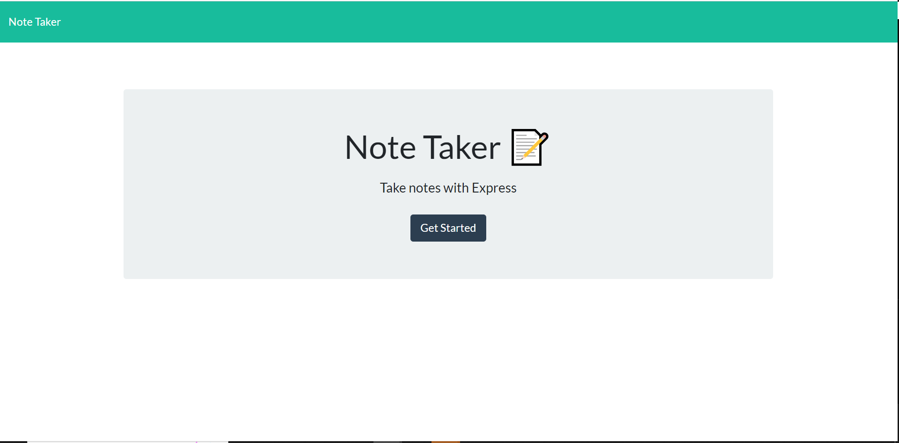
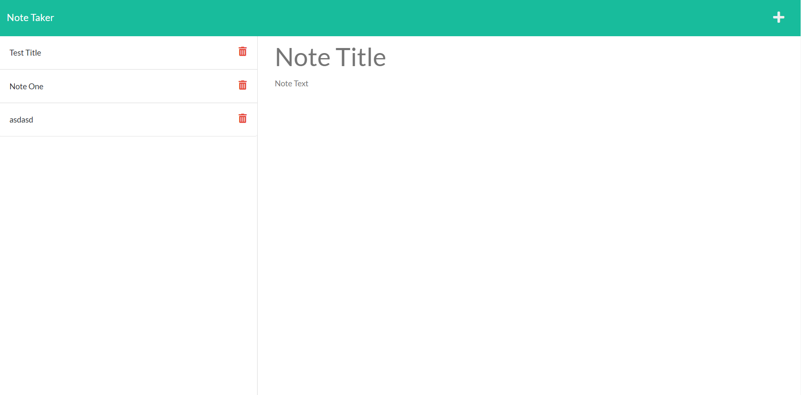

# E-Commerce_Back_End

## Description
The E-Commerce_Back_End is a simple program that showcases a crud application. 

## Deployed Link

(insert deployed link here)

## Table of Contents
- [Installation](#installation)
- [Contribution](#contribution)
- [License](#license)
- [Contact](#contact)

## Installation
Run "npm i" in the terminal to install the required packages. After the packages are installed type you can run "node server.js" to access the link in localhost:3000. Once there you can utilize the note taking app. 

Alternatively, you can access the deployed link above and utilize the app that way. 

## Contribution
Code provided by Jeff Hicks

## License
This project is licensed with MIT License. 

## Contact
- Author: Jeff Hicks
- Email: hicks.jeff@me.com
- Github: https://github.com/jixxin